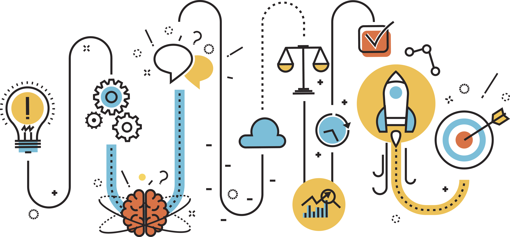

# 📌 Intro - Pengenalan Design Thinking


_Note:_ Sub bab ini penjelasan Design Thinking dikemas dalam sebuah Studi Kasus yang dikerjakan di _Miniclass UX_ Semester Genap 2021, yaitu _**Redesigning KFCKU Mobile App.**_


## ❓ Apa itu Design Thinking?

Design thinking adalah suatu proses perumusan dan pemecahan masalah yang berfokus pada manusia sebagai seorang pengguna. Proses ini dilakukan oleh desainer produk atau UX Designer, melibatkan pencarian masalah, dan menentukan apa yang sebenarnya dibutuhkan oleh seorang _user_.

## ⁉ Kenapa Design Thinking?

Karena Perilaku dan keinginan dari pengguna produk terus berubah dari waktu ke waktu, perubahan preferensi ini tak selalu terlihat. Seorang UX Designer menggunakan Design Thinking untuk mengatasi masalah yang tidak terdefinisi / tidak diketahui. 

Hal lain adalah supaya _designer_ bisa bereksplorasi dan mendapatkan sebanyak mungkin 'kemungkinan ide' dan tidak tertutup atau _judgemental_ terhadap ide-ide liar. Dengan cara me-_reframe_ masalah, dan fokus pada apa yang paling penting bagi pengguna. Design Thinking memungkinkan tim untuk membuat ide dan menghasilkan solusi inovatif dengan cara mendemokrasikan desain melalui _prototype_ dan _testing_.

## 📒 4 Prinsip Design Thinking

* Fokus pada manusia dan kebutuhannya
* Semua masalah bersifat ambigu, dapat dipertanyakan dan ditafsirkan secara berbeda
* Terdapat aturan mendesain ulang untuk menjaga agar desain tetap relevan untuk kebutuhan dasar dan preferensi manusia
* Terdapat aturan _tangibility_, yaitu desain dibuat nyata sehingga mudah dipahami dan tak menghambat komunikasi dalam tim desainer

## 🎢 Fase-fase Pada Design Thinking

### 🎭 Emphatize

Tahap awal pada Design Thinking adalah _emphatize_. Yaitu berempati kepada _user_. Hal pertama yang harus dilakukan adalah mencari tahu siapa saja _user_ yang akan dituju. 

Ketika sudah mengetahui user atau pengguna yang akan dituju, maka seorang desainer perlu mengetahui pengalaman, emosi, dan situasi dari si pengguna. Mencoba menempatkan diri sebagai pengguna sehingga dapat benar-benar memahami kebutuhan pengguna. Hal ini dapat dilakukan dengan melakukan wawancara, observasi kehidupan pengguna, dan cara lainnya.

### [📎](https://emojipedia.org/paperclip/) Define

Setelah desainer mengerti kebutuhan pengguna, maka desainer perlu menggambarkan sebuah ide atau pandangan _user_ yang akan menjadi dasar dari produk atau aplikasi yang akan dibuat. Hal ini dapat dilakukan dengan membuat list kebutuhan _user_ dan menggunakan pengetahuan mengenai kondisi yang sedang terjadi.

### [💡](https://emojipedia.org/light-bulb/) Ideate

Dengan kebutuhan yang ada, maka desainer perlu menggambarkan solusi yang dibuthkan. Hal ini dapat dilakukan melakukan evaluasi bersama tim desain dengan menggabungkan kreativitas dari masing-masing desainer.

### [📱](https://emojipedia.org/mobile-phone/) Prototype

Ide yang sudah ada sebelumnya maka perlu langsung diimplementasikan dalam sebuah aplikasi atau produk uji coba. Perlu dihasilkan sebuah produk nyata dan kemungkinan skenario penggunaan.

### 💉 Test

Dari produk atau aplikasi uji coba yang sudah dibuat, maka akan dilakukan sebuah percobaan dengan pengguna. Dari pengalaman pengguna dalam menggunakan produk uji coba, maka akan didapatkan masukkan untuk membuat produk yang lebih baik dan melakukan perbaikan pada produk yang ada.


_Note_: Design Thinking adalah proses yang **iteratif** atau **berulang**. Ketika proses _Testing_ sudah dilakukan, sangat penting untuk mengelola _feedback_ dari hasil _testing_ tersebut untuk kembali mengulang tahap _Empathize_ dan seterusnya sampai menemukan hasil yang maksimal.


## [🍲](https://emojipedia.org/pot-of-food/) [🍛](https://emojipedia.org/curry-rice/) UberEATS, Contoh Produk Sukses yang Menerapkan Design Thinking

UberEATS memiliki misi untuk membuat pengalaman terbaik memesan makanan bagi semua orang. Mereka memberikan berbagai macam opsi memilih makanan dan membantu berbagai restoran dan rumah makan untuk mendapat lebih banyak pelanggan.

Untuk mencapai misi tersebut, UberEATS harus merancang dan mendesain sebuah produk yang dapat memudahkan orang-orang untuk mencari makanan saat lapar. Selaras dengan semakin lumrahnya penggunaan _smartphone,_ membuat tim desain UberEATS harus bisa mengkombinasikan perkembangan teknologi dengan aktivitas makan dan menikmati makanan yang sangat universal.

Tim Desainer menerapkan disiplin ilmu Design Thinking untuk mencapai hal tersebut. Dengan membangun empati dengan pengguna, hasilnya produk UberEATS bisa menjangkau banyak orang dengan kebutuhan yang berbeda-beda dalam aktivitas makan dan menikmati makanan.

### [👨](https://emojipedia.org/man/) [👩](https://emojipedia.org/woman/) Berusaha Menjangkau Banyak Orang

UberEATS beroperasi di lebih dari 80 kota di seluruh dunia, masing-masing dengan budaya makanan, infrastruktur kota, dan tantangan logistik yang unik. Untuk memahami semua pasar yang berbeda dan bagaimana produk tersebut sesuai dengan kondisi fisik setiap kota, UberEATS terus-menerus menjangkau pelanggan di tempat mereka tinggal, bekerja, dan makan.

###  **🔁** Melakukan Iterasi dengan Cepat

Kecepatan sangat penting. Bisnis pada UberEATS adalah pasar yang perlu menjangkau massa dengan cepat untuk memberikan manfaat kepada setiap pelanggan yang berbeda. Pemilik restoran dan rumah makan juga perlu menerima pesanan yang cukup dari konsumen untuk mendapatkan uang yang banyak.

Mereka perlu membangun produk dengan cepat agar basis pelanggannya dapat tumbuh dengan cepat. Iterasi cepat memungkinkan UberEATS bergerak cepat dan memastikan kami mendapatkan desain yang tepat.

###  [💡](https://emojipedia.org/light-bulb/) Berinovasi Secara Terus Menerus

Tim desain UberEATS terus berupaya untuk menghasilkan inovasi seperti ini dan memberikan cara baru bagi orang untuk makan dan cara baru bagi restoran untuk menjalankan bisnis mereka.

Contohnya adalah mereka merancang _dashboard_ penjualan pada restoran agar _chef_ restoran tersebut dapat memantau permintaan masing-masing hidangan dan menyesuaikan resep untuk menyempurnakan menu mereka. Lalu mereka juga membuat opsi untuk memilih menu "Di Bawah 30 Menit" untuk orang yang ingin memanfaatkan kecepatan Uber untuk mendapatkan makanan dengan cepat pada aplikasi mereka.

### [🎁](https://emojipedia.org/wrapped-gift/) Dampaknya

Penerapan Design Thinking pada UberEATS membuahkan hasil yang memuaskan. Hanya dalam waktu singkat, mereka telah berkembang ke lebih dari 80 kota di seluruh dunia. Mereka telah memberi restoran cara baru untuk menjangkau pelanggan dan membangun bisnis. Mereka menemukan cara baru bagi orang yang lapar untuk menemukan dan menikmati makanan yang mereka sukai. Sebagai desainer, mereka bisa memecahkan masalah yang kompleks, secara positif mempengaruhi kehidupan orang.

#### Sumber:

* [Paul Clayton Smith di Medium](https://medium.com/uber-design/how-we-design-on-the-ubereats-team-ff7c41fffb76)

