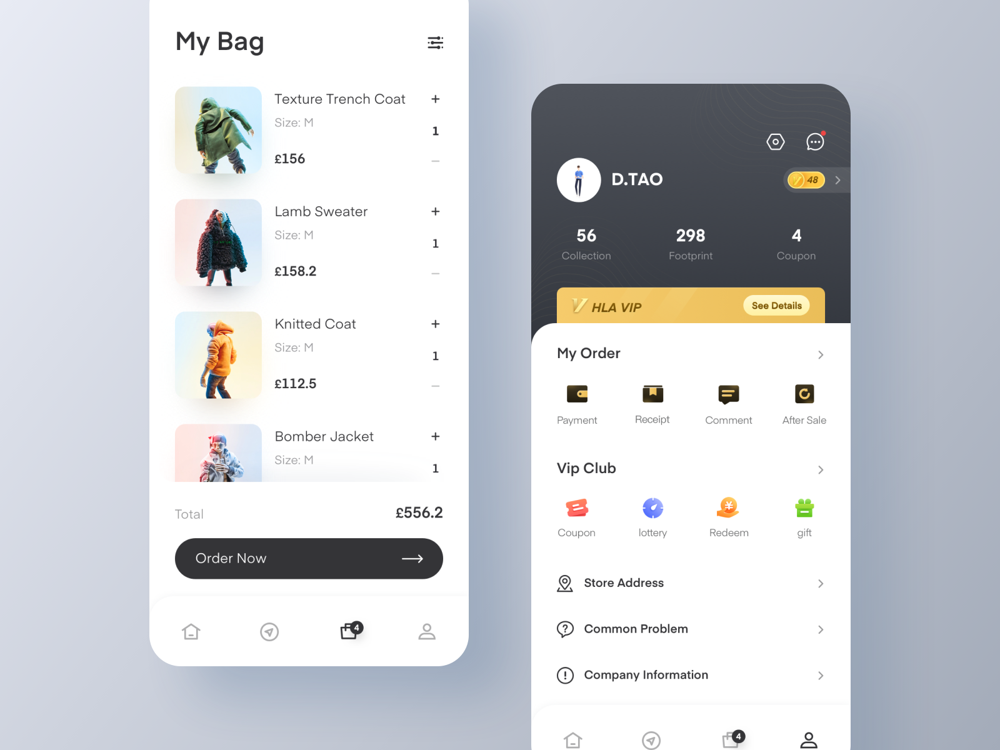

# Mockup Design

setelah kita menentukan design guideline yang kita anut, saatnya kita mendesain sebuah tampilan aplikasi. Desain tersbut dapat kita sebut Mockup.

## Pengertian

Mockup menurut kami adalah desain tampilan dari sebuah aplikasi yang akan digunakan / diterapkan pada aplikasi sesungguhnya. Tujuan dari Mockup tersebut adalah mendesain tampilan dari aplikasi yang akan kita buat. Karena kita ketahui bahwa tidak semua developer aplikasi memiliki ilmu desain yang baik.

## Tools

Software yang dapat kita gunakan untuk membuat sebuah mockup aplikasi adalah software desain seperti pada umumnya. yaitu (pilih salah satu aja) :

- Adobe Illustrator / Corel Draw (Vector Based)
- Adobe Photoshop (Pixel Based)

Tetapi software tersebut sebenarnya sangat jarang digunakan oleh UX Designer. Mengapa? karena dengan menggunakan aplikasi tersebut, kita tidak dapat menginteraksikan design yang kita buat. Oleh karena itu, kita membuat mockup aplikasi menggunakan aplikasi berikut :

- Figma (Web, Windows, Mac)
- Sketch (Mac only) (Khusus orang kaya)
- Adobe XD (Windows, Mac)

Linux pake apa? Pake Figma. Soalnya figma bisa dibuka di web :)
