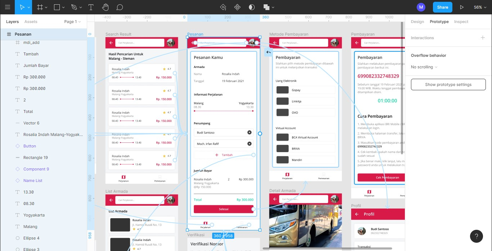

# Prototyping

## Permasalahan

Ketika kita sudah membuat mockup, maka semua tahap UI sebenarnya sudah selesai. Tapi bagaimana cara agar desain yang kita buat dapat di interaksikan? bagaimana cara agar kita menjelaskan kepada orang-orang luar terkait desain yang sudah kita buat? Apakah kita harus membuat Slide / Presentasi untuk mempresentasikan hasil desain yang kita buat? Maka kita melakukan tahap dalam UI Design yaitu Prototyping

## Pengertian

Menurut wikipedia, ‎Prototipe ‎‎adalah‎‎ sampel awal, model, atau pelepasan produk yang dibuat untuk menguji konsep atau ‎‎Proses. Ini adalah istilah yang digunakan dalam berbagai konteks, ‎‎termasuk semantik,‎‎ ‎‎desain,‎‎ ‎‎elektronik ‎dan ‎‎pemrograman perangkat lunak‎‎. Prototipe umumnya digunakan untuk mengevaluasi desain baru untuk meningkatkan presisi oleh analis dan pengguna sistem.

## Tahapan

Untuk melakukan prototyping di figma, terdapat fitur prototype di aplikasi tersebut.

1. Klik protoype (kanan atas aplikasi figma)
2. Pertama, kita klik sebuah item / tombol yang akan kita interaksikan.
3. Terdapat bundar / pentolan di sebelah kanan item tersebut. Tarik dari pentolan tersebut ke halaman / frame tujuan.
4. Kita dapat mengubah aksi dari prototype tersebut di bagian prototype (sebelah kanan figma), misal mengubah animasi, mengubah aksi menjadi on drag, on hover, dll, mengubah reaksi menjadi open overlay, atau mengubah durasi animasi, dll.
