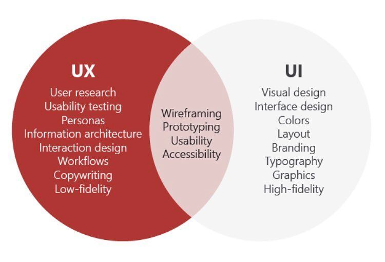

# Penjelasan UX

## Pengertian

Ux adalah proses meningkatkan kepuasan user dan memberikan pengalaman bermakna dan relevan bagi user yang memakai produk tersebut.

Bahasa gampanya ux design itu proses membuat website atau app yang kamu buat menjadi mudah untuk digunakan dan tidak membingungkan user. Ux Design sendiri outputnya bukan hanya berupa produk digital tapi juga produk seperti desain interior rumah,desain mobil bahkan desain sebuah teko juga memerlukan ux.

## Perbedaan UI dan UX

### What is UI

UI atau User Interface merupakan mekanisme komunikasi antara pengguna (user) dengan sistem pada sebuah program, baik itu aplikasi website, mobile, ataupun software. Mekanisme itu disesuaikan dengan kebutuhan pengguna terhadap program yang tengah dikembangkan. Cakupan UI itu meliputi tampilan fisik, penggunaan warna, tampilan animasi, hingga pola komunikasi suatu program dengan penggunanya.

### Whats is UX

User Experience memang tidak terlalu jauh berbeda dengan UI. Perbedaannya terletak pada fokus utama hubungan komunikasi antara pengguna dengan programnya, yakni berfokus pada pengalaman penggunanya.

### Perbedaannya

Tadi sudah disinggung bahwa perbedaan antara UI dan UX berada pada fokus utamanya. Bila UI fokus pada interaksi pengguna dengan programnya, maka UX fokusnya pada pengalaman pengguna dalam menggunakan suatu aplikasi web atau mobile.

Seorang desainer UI akan mendesain program aplikasi web atau mobile-nya sesuai dengan kebutuhan si pengguna. Sehingga, ketika menggunakan program tersebut pengguna lebih mudah dan tidak kesulitan.

Sedangkan, desainer UX membuat program berdasarkan pengalaman dari penggunanya. Apa saja yang dirasakan dan kesulitan apa saja yang dihadapi ketika menggunakan program tersebut.

Sebenarnya, keduanya memiliki tujuan yang sama dalam mendesain program aplikasi web ataupun mobile, yakni memudahkan penggunannya. Oleh sebab itu, seringkali dalam proses perancangan sebuah program, desainer UI dan UX selalu berada dalam satu tim. Sebab, dengan perpaduan keduanya, sebuah program aplikasi web ataupun mobile menjadi sangat mudah digunakan oleh pengguna tanpa harus membaca panduan. Seringkali, desainer UI dan UX bertukar data analisis untuk menyempurnakan program yang tengah dibuatnya.
