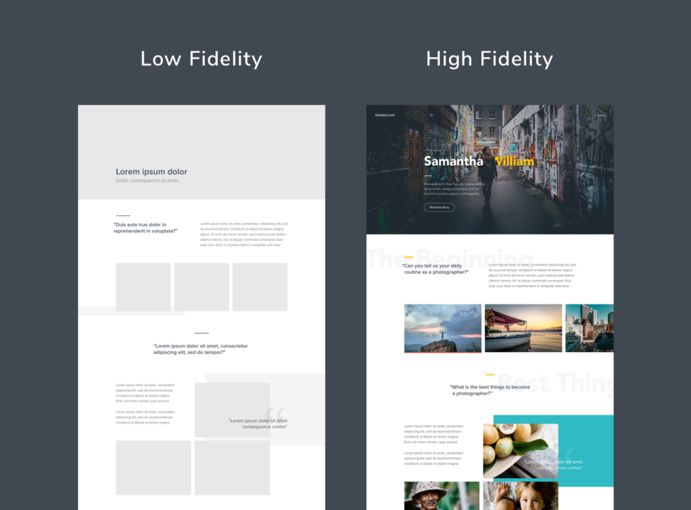

# Membuat Wireframe

Sebelum tahap development suatu website dimulai, tentu kita harus terlebih dahulu memiliki perancangan yang baik dan benar agar sesuai dengan target yang ingin dicapai. Perancangan suatu website tentu tidak lepas dari desain User Interface \(UI\) yang bertujuan merancang tampilan website. Salah satu tahap awal dalam merancang user interface adalah Wireframing.

## Pengertian

Wireframe adalah kerangka atau coretan kasar untuk penataan item-item pada halaman website sebelum proses desain sesungguhnya dimulai. Contoh item-item yang bisa ditata diantaranya banner, header, content, footer, link, form input, dll. Biasanya proses ini ditugaskan kepada UI Designer. Untuk merancang wireframe sang UI Designer bisa menggunakan coretan tangan di kertas ataupun menggunakan tools desain khusus wireframing. Secara visual wireframe hanya berupa garis dan kotak yang mengatur tata letak elemen-elemen pada website.

## Manfaat Wireframe

Dengan adanya wireframe, web developer sangatlah terbantu pada pekerjaan mereka agar dalam proses pengembangan dapat terstruktur dan terarah. bayangkan bila tidak menggunakan wireframe terlebih dahulu mungkin saja dalam proses pengembangan sering terajadi revisi/perbaikan yang sangat memperlambat pekerjaan.

## Elemen

1. Desain Informasi

Pada elemen ini biasanya bersumber dari hasil riset apa saja konten atau informasi yang ingin disampaikan, yang dapat diilustrasikan sebagaimana pada saat presentasi di sekolah atau kampus, haruslah memiliki informasi yang terpercaya. Contohnya form input, thumbnail, gambar, link, paragraf, dll.

1. Navigasi

User interface tentu haruslah memiliki tampilan yang mudah digunakan, salah satu hal penting dalam website adalah navigasi. Diibaratkan navigasi adalah kompas yang berguna untuk memberikan petunjuk bagi pengguna agar tidak membingungkan, jika hal itu terjadi kemungkinan besar pengguna akan meng-close halaman website yang telah dibangun. Manfaat dengan adanya navigasi terlihat profesional karena lebih rapih konten

1. Desain Interface

Pada bagian ini dimana proses diseleksi dan penempatan elemen misalnya tombol, link, judul, text-align, font-size, dll. Yang bertujuan sebagai media bagi pengguna dalam berinteraksi dengan tampilan.

