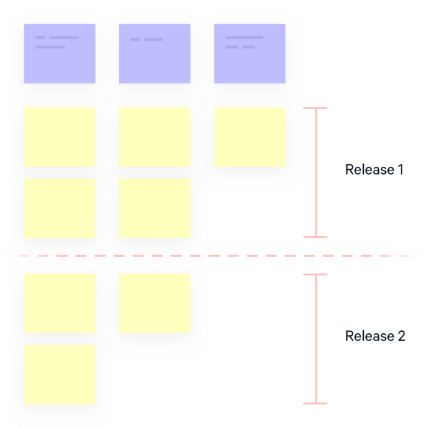

# Melakukan User Story Mapping

Ketika kita sudah menentukan user story dari topik-topik yang dibahas, pasti ada sesuatu yang ganjal. Yaitu :

* Apakah fitur ini penting?
* Mana fitur yang harus dikerjakan dahulu?
* Mana fitur yang memiliki prioritas lebih tinggi?

Semua akan terjawab ketika kita belajar user story.

## Pengertian

User Story Mapping adalah teknik yang dikembangkan oleh Jeff Patton selama praktiknya yang panjang sebagai pemilik / pemilik scrum produk Agile. Sesuai namanya, User Story Mapping ada karena membantu memetakan cerita pengguna dan item simpanan lainnya secara visual. Item disusun dalam dua dimensi: Yang vertikal menunjukkan prioritas, sedangkan yang horizontal mewakili langkah yang dilakukan pengguna untuk melakukan tindakan dalam sistem \(perjalanan pengguna\).

## Struktur

Bagaimana User Story Mapping bisa membantu memudahkan pemilihan prioritas kerja? Terdapat Struktur User Story Mapping yaitu :

* Backbone. Backbone adalah dasar dari peta. Ini terdiri dari epos atau tema, yang menggambarkan keseluruhan aktivitas pengguna dalam sistem, mis. mencari produk. Epik disusun dalam urutan horisontal karena mewakili langkah-langkah yang diambil pengguna saat berinteraksi dengan produk, yang pada dasarnya merupakan tampilan sederhana dari perjalanan pengguna.
* User Story. Tidak seperti struktur backlog datar, User Story disusun dalam dimensi vertikal dan horizontal. Semua User Story dikelompokkan dalam kelompok yang sesuai, yang menjelaskan tugas-tugas yang lebih spesifik yang mungkin diperlukan pengguna. Jika sebuah epik menggambarkan suatu fase pencarian, itu mungkin termasuk cerita seperti pencarian dasar, penyaringan produk, pencarian lanjutan, dll. Ketika cerita diprioritaskan secara vertikal, mereka dapat dibagi menjadi rilis.
* User Persona adalah representasi fiksi dari orang-orang yang akan menggunakan produk / melakukan langkah-langkah yang dijelaskan dalam User Story. Dibuat oleh spesialis UX setelah wawancara pengguna, personas memberikan deskripsi tentang siapa pengguna, dan bagaimana mereka mungkin berinteraksi dengan produk. Pada peta cerita, persona terikat dengan epos khusus yang akan mereka ikuti.
* Ide dan bagus untuk dimiliki. Untuk menggambarkan gambar penuh, peta cerita juga dapat mencakup bagian seperti ide atau fitur yang bagus untuk dimiliki. Ini akan mengingat cerita pengguna yang belum dibutuhkan atau tidak disebutkan dalam persyaratan awal, tetapi masih menambah nilai pada produk.

## Manfaat

Pendekatan yang dijelaskan oleh Jeff Patton hanyalah salah satu dari banyak cara untuk menyusun User Story. Dalam hal apa pun, cara kami mengatur item simpanan di dalam peta menawarkan manfaat berikut:

* Prioritas yang jelas. Pendekatan umum tentang bagaimana peta cerita disusun membuatnya mudah untuk memprioritaskan setiap cerita, menjaga hubungan antara item besar dan kecil.
* User Journey. User Story Backbone adalah versi User Journey yang disederhanakan.
* Tujuan dan visi produk yang jelas. Story Map adalah dokumen dinamis yang akan diperluas seiring pertumbuhan produk.
* Komunikasi yang baik. Product backlogs dibuat oleh satu orang, seorang product owner.

