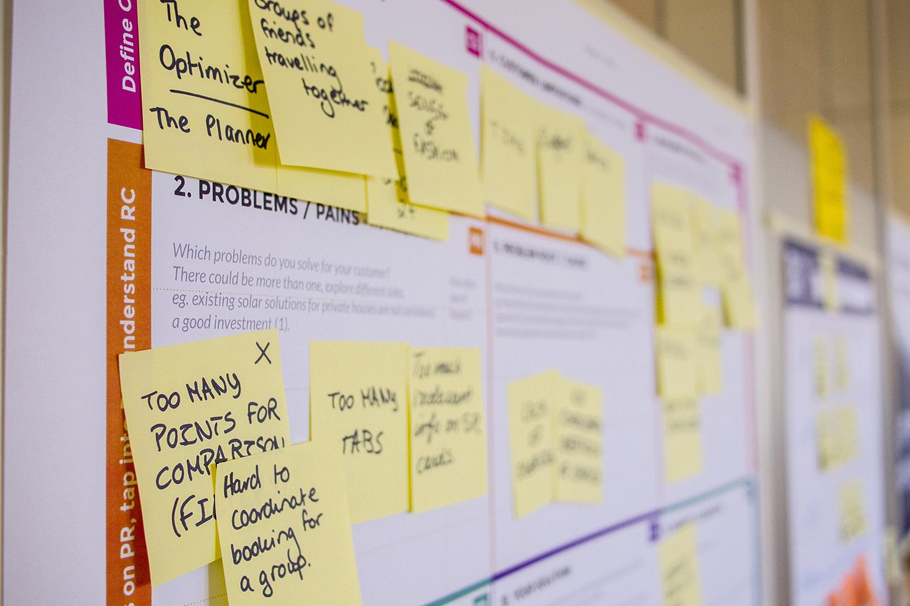

# Membuat User Story

## Pengertian

Dalam pengembangan perangkat lunak dan manajemen produk, User Story adalah deskripsi informal, bahasa alami dari satu atau lebih fitur sistem perangkat lunak. User Story adalah alat yang digunakan dalam pengembangan perangkat lunak Agile untuk menangkap deskripsi fitur perangkat lunak dari perspektif End User. Sebuah kisahUser Story menggambarkan apa yang mereka inginkan dan mengapa. User Story membantu membuat deskripsi persyaratan yang disederhanakan.

## Tujuan

Ada beberapa manfaat untuk mengadopsi pendekatan cerita pengguna dalam pengembangan tangkas seperti:

* Format yang sederhana dan konsisten menghemat waktu ketika menangkap dan memprioritaskan persyaratan sambil tetap cukup fleksibel untuk digunakan pada fitur besar dan kecil.
* Memberikan nilai bisnis dengan memberikan produk yang benar-benar dibutuhkan klien
* Menghindari memperkenalkan detail terlalu dini yang akan mencegah opsi desain dan mengunci pengembang secara tidak tepat menjadi satu solusi.
* Hindari penampilan kelengkapan dan kejelasan yang keliru
* Dapatkan potongan cukup kecil yang mengundang negosiasi dan gerakan di tumpukan
* Serahkan fungsi teknis kepada arsitek, pengembang, penguji, dan sebagainya

## Cara Menulis User Story

* Sebagai apakah anda?
* Apa keinginan anda?
* Untuk apa anda melakukan itu? \(Opsional\)

Contoh :

> Sebagai pengguna aplikasi, aku ingin memilih barang yang ingin aku beli dengan mudah agar aku bisa dengan cepat membeli barang yang aku inginkan

