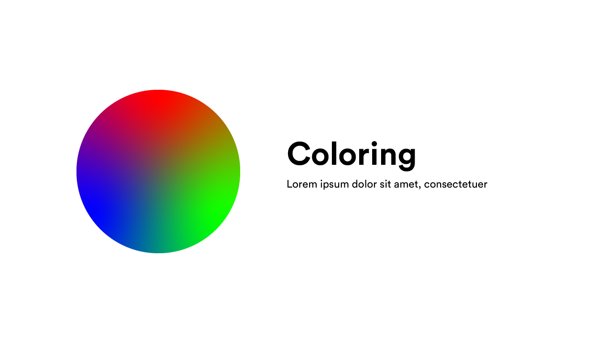

# Coloring

## Pengertian

Coloring adalah sebuah teknik untuk memperindah desain vektor dengan cara memberi warna. Warna pada desain vektor dapat diletakkan pada fill dan outline.

## Color Spaces

Pada desain vektor terdapat beberapa Color Spaces seperti halnya pada desain bitmap. Hanya saja pada desain vektor lebih terlihat perubahan yang signifikan dari Color Space tersebut. Color Spaces terdiri dari RGB, CMYK, HSL, dan K.

1. RGB : biasa digunakan pada desain digital seperti web, mobile, e book, dll.
2. CMYK : biasa digunakan pada desain printing seperti paper print, sablon, dll.
3. HSL : hampir sama seperti RGB, hanya saja dengan menggunakan HSL, kita dibuat lebih mudah karena hanya menggeser hue (warna), saturation (ketajaman warna), lightness (kececrahan warna).
4. K : hanya hitam dan putih

## Jenis Pewarnaan

pada desain vektor, ada beberapa tipe pewarnaan yang tersedia seperti color, gradient, dan no color, dll.

### Beginner

#### Color

Color disini adalah kita memberikan 1 warna pada suatu bangun vektor, seperti merah saja, kuning saja, tanpa mencampur warna lain.

#### Gradient

Gradient disini adalah memberikan beberapa warna pada jarak tertentu, pada jarak tersebut terdapat transisi warna.

### Advanced (dengan support yang lebih sedikit)

Disini kita akan memberi tahu beberapa pewarnaan yang menarik namun tidak semua aplikasi mendukung desain yang kita buat.

#### Gradient Mesh

Gradient mesh disini adalah kita memberikan warna pada node dari bentuk vektor.

#### Freeform Gradient

Freeform Gradient disini adalah kita memberi warna pada titik-titik tertentu didalam vektor.
