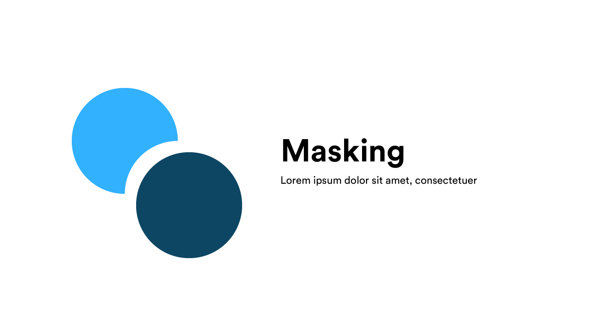

# Masking

## Pengertian

 Masking secara bahasa adalah penutup / topeng. Disini dapat kita ketahui bahwa masking adalah menutupi suatu bagian vektor dengan vektor yang lain.

## Tujuan

Tujuan dari masking adalah kita dapat menutupi suatu layer dengan bangun vektor yang diatasnya. layer tersebut dapat berupa vektor, image, dll.

## Cara

### Clipping mask

1. Letakkan layer yang ingin di masking
2. Letakkan layer masker diatas yang ingin di masking
3. Klik kanan &gt; make / create clipping mask \(tergantung aplikasi\)

### Pathfinder

Pada hal ini, hampir semua aplikasi desain vektor memiliki fitur ini. Hal yang dapat dilakukan adalah unite, intersect, minus front dan exclude. Namun pada illustrator, terdapat beberapa fitur baru seperti, divide, trim, merge, crop, outline, dan minus back.

### Shape Builder Tool

Sebenarnya, fitur ini juga tidak bisa dikatakan fitur masking. tapi fitur ini sangat berguna untuk kalian yang ingin bikin bentuk aneh-aneh tanpa mikirin pathfinder.

