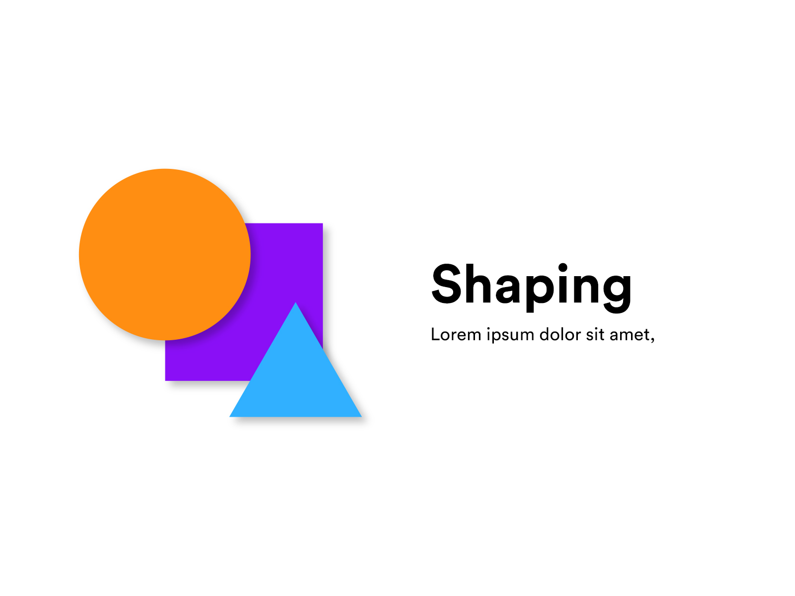

# Shaping

## Pengertian

 Shaping adalah seebuah teknik / cara untuk menggambar suatu bentuk vektor.

## Tools Yang Digunakan

### Create

Untuk melakukan shaping, kita dapat menggunakan tools seperti :

1. rectangle, untuk membuat persegi panjang
2. circle, untuk membuat lingkaran
3. polygon, untuk membuat poligon seperti segitiga, segilima, segienam, dll.
4. pen tool, untuk membuat bentuk kurva

### Select

Untuk melakukan seleksi, kita dapat menggunakan Selection Tools dan Direct Selection Tools.

Perbedaannya adalah ketika kita menggunakan Selection Tools, kita menyeleksi 1 bangun datar tersebut.

Ketika menggunakan Direct Selection Tools, kita menyeleksi 1 bagian dari bangun tersebut. 1 bagian tersebut dapat berupa sudut dan sisi

### Transforming

Untuk melakukan seleksi, kita dapat menggunakan Selection Tools dan Direct Selection Tools.

Jika kita menggunakan Selection Tools, Kita dapat mengubah secara dimensi seperti Width, Height, Angle, Scale, Pos X, Pos Y, dll.

Jika kita menggunakan Direct Selection Tools, kita dapat memindahkan posisi suatu node \(titik\) atau segment \(garis\) sesuai yang kita inginkan. Direct Selection Tools memungkinkan kita untuk mengubah bentuk dari bangun datar vektor seperti segiempat menjadi segitiga, trapesium, jajar genjang, dll.

### Reshaping

Untuk melakukan reshape, kita biasa menggunakan pen tool dan Direct Selection Tools.

Pen Tool dapat digunakan untuk menambahkan dan menghapus node \(titik\) didalam suatu segment \(garis\), sehingga kita dapat menggunakannya untuk merubah bentuk menjadi segilima, segienam, segitiga, dll.

Direct Selection Tools juga dapat mengubah sudut masuk dan keluar dari suatu node.

